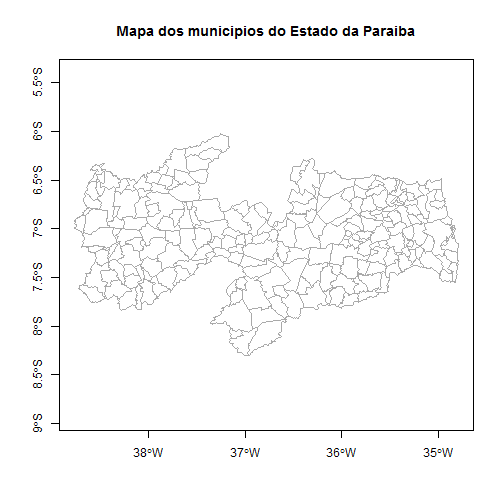

## Como plotar um mapa no R

#### Função: plot

Para plotar um mapa de um objeto carregado usando a função `readOGR`, podemos usar a função `plot`.

Parâmetros interessantes da função: 
- `axes`: Indica se devem ser plotados os eixos x e y do gráfico
- `border`: Define a cor da borda dos polígonos. (Exemplos: "black", "darkgray", "red", etc)
- `main`: Texto do título do gráfico.

1) Vamos carregar o shapefile:

```r
library("rgdal");
sp_mapa_rgdal <- readOGR(dsn="sp_municipios", layer="35MUE250GC_SIR", 
                         verbose=FALSE, stringsAsFactors=FALSE);
```

**2) Vamos plotar o mapa**

```r
plot(sp_mapa_rgdal, axes=TRUE, border="darkgray", main="Mapa dos municipios do Estado de Sao Paulo");
```

 

Sugestões de busca em inglês: "r plot shapefile".

***

#### Em outros pacotes: maptools - função: plot

A função `plot` também serve para plotar mapas de objetos carregados usando a função `readShapeSpatial`.

1) Carregando o shapefile:

```r
library("maptools");
sp_mapa_maptools <- readShapeSpatial(fn="sp_municipios/35MUE250GC_SIR");
proj4string(obj=sp_mapa_maptools) <- "+proj=longlat +ellps=GRS80 +no_defs";
```

**2) Vamos plotar o mapa**

```r
plot(sp_mapa_maptools, axes=TRUE, border="darkgray", main="Mapa dos municipios do Estado de Sao Paulo");
```

 

****

#### Em outros pacotes: PBSmapping - função: plotPolys

Já para objetos carregados usando a função `importShapefile`, precisamos usar a função `plotPolys` do pacote `PBSmapping`.

1) Carregando o shapefile:

```r
library("PBSmapping");
sp_mapa_pbsmapping <- importShapefile(fn="sp_municipios/35MUE250GC_SIR", readDBF=TRUE);
```

**2) Vamos plotar o mapa**

```r
plotPolys(polys=sp_mapa_pbsmapping, projection=TRUE, border="darkgray", main="Mapa dos municipios do Estado de Sao Paulo");
```

 

