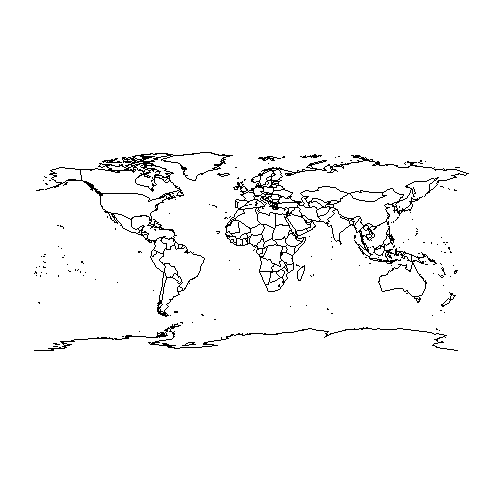

## Como plotar um mapa no R com o pacote ggplot2

#### Função: ggplot + geom_polygon + coord_map

Para plotar um mapa de um objeto carregado usando a função `readOGR`, podemos usar a função `ggplot` com a função `geom_polygon` e a função `coord_map`.

Parâmetros interessantes da função:
- `data`:    Define os dados a serem usados para criar o mapa. 
- `mapping`: `aes`
  - `x`:     Nome da coluna com as coordenadas das longitudes.
  - `y`:     Nome da coluna com as coordenadas das latitudes.
  - `group`: Nome da coluna com os grupos que definem os polígonos.
  - `fill`:  Nome da coluna com os grupos que definem as cores de preenchimento dos polígonos.
- `color`:   Define a cor da linha da borda dos polígonos.
- `fill`:    Define a cor de preenchimento dos polígonos. (Exemplos: "white", "brown", "blue", etc).

1) Vamos carregar o shapefile:

```r
library("rgdal");
pb_poligonos_rgdal <- readOGR(dsn="aesa_pb/Municipios", layer="Municipios", 
                              verbose=FALSE, stringsAsFactors=FALSE);
```

**2) Vamos plotar o mapa**

```r
library("rgeos");
library("maptools");
library("ggplot2");
library("mapproj");

# Verifica os nomes das colunas que podem ser usadas para definir os polígonos (municípios)
names(pb_poligonos_rgdal);
```

```
 [1] "OBJECTID"    "GEOCODIG_M"  "UF"          "Sigla"       "Nome_Munic" 
 [6] "Regi√.o"     "Mesorregi√." "Nome_Meso"   "Microrregi"  "Nome_Micro" 
[11] "Shape_Leng"  "Shape_Area" 
```

```r
# Requer os pacotes rgeos, maptools e ggplot2, carregados nesta ordem.
# Transforma os SpatialPolygonsDataFrame em um data.frame que pode ser usado pelo geom_polygon.
pb_poligonos_fortify <- fortify(model=pb_poligonos_rgdal, region="GEOCODIG_M");

# Plot
# coord_map(): Evita que o mapa fique distorcido, requer o pacote mapproj
ggplot() + 
  geom_polygon(data=pb_poligonos_fortify, 
               mapping=aes(x=long, y=lat, group=group), 
               color="black",
               fill="white") + 
  coord_map() + 
  labs(y="latitude", x="longitude", title="Municipios do Estado da Paraiba") + 
  theme(plot.title=element_text(hjust = 0.5) );
```



Sugestões de busca em inglês: "r plot shapefile with ggplot2".
