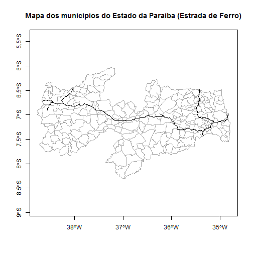

## Como plotar um mapa no R

#### Extra: Adicionar um shape de pontos

Vamos adicionar o shape de pontos de Sedes Municipais.

1) Carregar o shape de polígonos e verificar os atributos de sua projeção:

```r
pb_poligonos_rgdal <- readOGR(dsn="aesa_pb/Municipios", layer="Municipios", verbose=FALSE, stringsAsFactors=FALSE);

proj4string(pb_poligonos_rgdal);
```

```
[1] "+proj=longlat +ellps=aust_SA +no_defs"
```

2) Carregar o shape de pontos e verificar os atributos de sua projeção:

```r
pb_pontos_rgdal <- readOGR(dsn="aesa_pb/Sedes_Municipais", layer="Sedes_Municipais", verbose=FALSE, stringsAsFactors=FALSE);

proj4string(pb_pontos_rgdal);
```

```
[1] "+proj=longlat +ellps=aust_SA +no_defs"
```

**Observe** que no caso deste exemplo os atributos do shape de polígonos e de pontos são os mesmos. Caso eles fossem diferentes seria necessário transformar os atributos de um dos shapes para garantir a consistência de nossas análises.

3) Plotar o mapa de municípios e adicionar os pontos das sedes municipais:

```r
plot(pb_poligonos_rgdal, axes=TRUE, border="darkgrey", lty=1, lwd=1, col="white", main="Mapa dos municipios do Estado da Paraiba (Sedes Municipais)");

plot(pb_pontos_rgdal, add=TRUE, col="red", pch=19, cex=0.1);
```



Sugestões de busca em inglês:
