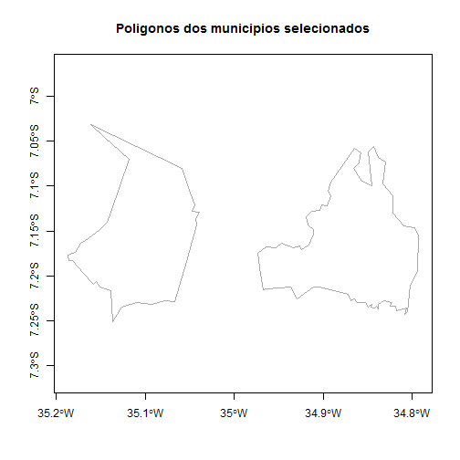
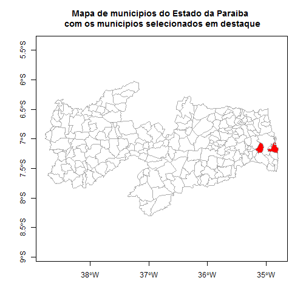

## Escolher 1 ou mais polígonos específicos

#### Função: slot + lógica de programação

Recomenda-se o uso da função `slot` em conjunto com algumas operações de lógica de programação.

Parâmetros interessantes da função: 
- `object`: Objeto com os dados do shape.
- `name`: Nome do slot que contém os dados de interesse.

1) Carregar o shapefile

```r
library("rgdal");
pb_poligonos_rgdal <- readOGR(dsn="aesa_pb/Municipios", layer="Municipios", verbose=FALSE, stringsAsFactors=FALSE);
```

**2) Separar os dados do shape num data frame**

```r
pb_dados <- slot(object=pb_poligonos_rgdal, name="data");
print( pb_dados[1:6, 1:5] );
```

```
  OBJECTID GEOCODIG_M UF Sigla    Nome_Munic
0        1    2500106 25    PB  Água Branca
1        2    2500205 25    PB        Aguiar
2        3    2500304 25    PB Alagoa Grande
3        4    2500403 25    PB   Alagoa Nova
4        5    2500502 25    PB     Alagoinha
5        6    2500536 25    PB      Alcantil
```

**Importante!** Observe que a coluna que contém os nomes dos municípios se chama `Nome_Munic` e está no objeto `pb_dados`.

**3) Criar uma lista com os nomes dos municípios desejados**

```r
lista_municipios <- c("Cruz do Espírito Santo", "João Pessoa");
```

**4) Encontrar o indice numérico correspondente aos municípios desejados**

**Observe** que neste passo usamos o nome da coluna que contém os nomes dos municípios (`Nome_Munic`) para este exemplo específico. 
**Lembre-se** de alterar esse nome para se ajustar aos seus dados!


```r
indice_numerico <- which( pb_dados$Nome_Munic %in% lista_municipios );
print(indice_numerico);
```

```
[1] 66 96
```

**5) Pegar apenas as informações dos polígonos dos municípios desejados**

```r
dados_municipio <- pb_poligonos_rgdal[indice_numerico, ];
```

6) Fazer o plot dos municípios desejados

```r
plot( dados_municipio, axes=TRUE, border="darkgrey", main="Poligonos dos municipios selecionados" );
```



Sugestões de busca em inglês: "r subset polygon shapefile", "r get polygon shapefile"

Sugestões de busca em português: "r como selecionar 1 polígono específico", "r como selecionar vários polígonos", "como selecionar os polígonos alguns municípios".

***

#### Extra

Caso queria plotar os poligonos sobre o mapa de municípios basta fazer o que segue:

```r
plot( pb_poligonos_rgdal, axes=TRUE, border="darkgrey", main="Mapa de municipios do Estado da Paraiba \n com os municipios selecionados em destaque" );
plot( dados_municipio, border="darkgray", col="red", add=TRUE );
```



****

#### Extra - Problemas com Encoding

Caso você tenha problemas de encoding no **passo 2**, tente usar a função `read.dbf` do pacote `foreign` para ler o arquivo "\*.dbf".


```r
library("foreign");
pb_dados <- read.dbf(file="aesa_pb/Municipios/Municipios.dbf", as.is=TRUE);
```
