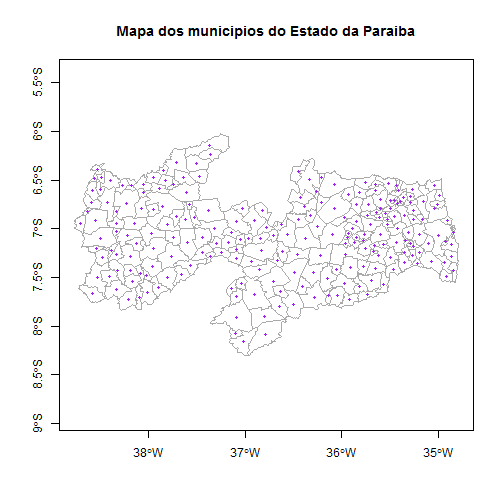

## Calcular o centróide de 1 ou mais polígonos

#### Função: coordinates

Recomenda-se o uso da função `slot` em conjunto com algumas operações de lógica de programação.

1) Carregar o shapefile

```r
library("rgdal");
pb_poligonos_rgdal <- readOGR(dsn="aesa_pb/Municipios", layer="Municipios", verbose=FALSE, stringsAsFactors=FALSE);
```


```r
pb_dados <- slot(object=pb_poligonos_rgdal, name="data");

lista_municipios <- c("Cruz do Espírito Santo", "João Pessoa");

indice_numerico <- which( pb_dados$Nome_Munic %in% lista_municipios );
print(indice_numerico);
```

```
[1] 66 96
```

```r
dados_municipios <- pb_poligonos_rgdal[indice_numerico, ];

centroide_poligono <- coordinates(obj=dados_municipios);

print(centroide_poligono);
```

```
        [,1]      [,2]
65 -35.10375 -7.152402
95 -34.86931 -7.164967
```

```r
plot(centroide_poligono, pch=19, cex=0.5, col="red");
```

 

```r
#text(x=centroide_poligono[1,1], y=centroide_poligono[1,2], "SÃO PAULO");
```
