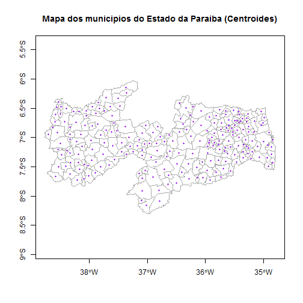

## Calcular o centróide de 1 ou mais polígonos

#### Função: coordinates

Recomenda-se o uso da função `coordinates` do pacote `sp`.

Parâmetros interessantes da função: 
- `obj`: Objeto com os dados do shape.

1) Carregar o shapefile

```r
library("rgdal");
pb_poligonos_rgdal <- readOGR(dsn="aesa_pb/Municipios", layer="Municipios", 
                              verbose=FALSE, stringsAsFactors=FALSE);

proj4string(pb_poligonos_rgdal);
```

```
[1] "+proj=longlat +ellps=aust_SA +no_defs"
```

**2) Calcular as coordenadas dos centróides dos polígonos**

```r
centroide_poligonos <- coordinates(obj=pb_poligonos_rgdal);
```

**3) Transformar as coordenadas para um objeto SpatialPoints e definir os atributos da projeção para serem os mesmos dos polígonos**

```r
centroide_poligonos <- SpatialPoints(coords=centroide_poligonos, 
                                     proj4string=CRS( proj4string(pb_poligonos_rgdal) ) );

proj4string(centroide_poligonos);
```

```
[1] "+proj=longlat +ellps=aust_SA +no_defs"
```

4) Plotar o mapa de municípios adicionando os pontos dos centróides calculados anteriormente.

```r
plot(pb_poligonos_rgdal, axes=TRUE, border="darkgrey", lty=1, lwd=1, col="white", 
     main="Mapa dos municipios do Estado da Paraiba (Centroides)");

points(centroide_poligonos, pch=19, cex=0.5, col="purple");
```



Sugestões de busca em inglês: "r polygon centroid".
